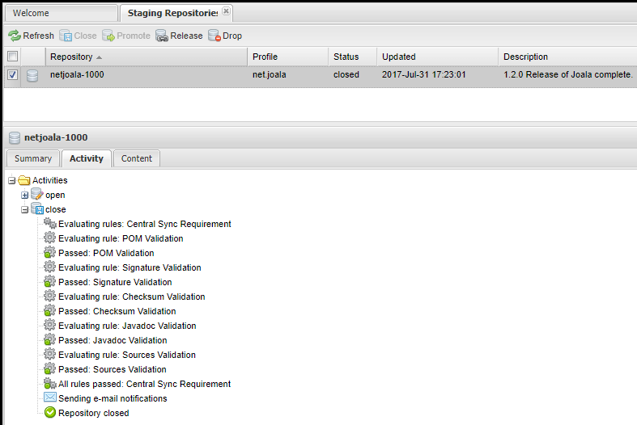

# How to release Joala

## Release Preparations

* *Deprecated:* Ensure that you have configured GitHub for site deployment in your `settings.xml`:
    This is required in order to deploy the Maven site to [Joala GitHub Pages][].

    ```xml
    <servers>
      <server>
        <id>github-project-site</id>
        <!-- the username really is git, do not change this -->
        <username>git</username>
      </server>
    </servers>
    ```
    
    For deployment a fork of [wagon-gitsite][] by [kohsuke][kohsuke-wagon-gitsite] is used.
* *Evaluating Replacement for Wagon GitSite:* The last tries to use Wagon GitSite on release
    process failed miserable. Thus we are now going to try [Github Site Plugin][]. Just as
    Wagon GitSite you require user/password settings in your `settings.xml`:

    ```xml
    <servers>
      <server>
        <id>github</id>
        <username>YOUR_GITHUB_USERNAME</username>
        <password>YOUR_GITHUB_PASSWORD</password>
      </server>
    </servers>
    ```

    and for using OAuth Tokens:
    
    ```xml
    <servers>
      <server>
        <id>github</id>
        <password>OAUTH_TOKEN</password>
      </server>
    </servers>
    ```

    **Note:** The OAuth Token needs permissions `repo` and `user`. If you do not provide `user`
    permission, you will get a `RequestException: Not Found (404)` in `UserService.getEmails()`.
    
    The site will be deployed into a sub-directory with the naming pattern `joala-VERSION` on
    `site-deploy`. So you may test site deployment even outside the release process and you will
    get your site deployed with a snapshot version applied. 
* Ensure that you have set the passwords for Maven Central Deployment as described in
    [Sonatype OSS Maven Repository Usage Guide][oss-usage] in your `settings.xml`.
    Mind that you need to have an account at [Sonatype's JIRA][sonatype-jira].

    ```xml
    <servers>
      <server>
        <id>sonatype-nexus-snapshots</id>
        <username>your-jira-id</username>
        <password>your-jira-pwd</password>
      </server>
      <server>
        <id>sonatype-nexus-staging</id>
        <username>your-jira-id</username>
        <password>your-jira-pwd</password>
      </server>
    </servers>
    ```

    **Note:** The server ids are determined by the `oss-parent`. So possibly check the distribution management
    section for changed ids.
* Ensure that you have your GPG keys at hand and that you have published them to
    `hkp://pool.sks-keyservers.net/`.
    See [Working with PGP Signatures](http://central.sonatype.org/pages/working-with-pgp-signatures.html), section
    *Distributing Your Public Key* for details.

* Ensure that you have installed Maven 3.0.4 or higher.

## Note: Original Registration for Maven Central

* **Issue Number:** [OSSRH-5630][]
* **Date:** 2013-11-03
* **Reporter:** Mark Michaelis
* **Group ID:** `net.joala`
* **Project URL:** [http://coremedia.github.com/joala/]()
* **SCM URL:** [https://github.com/CoreMedia/joala]()
* **Username(s):** thragor
* **Response:**

    > Configuration has been prepared, now you can:
    > * Deploy snapshot artifacts into repository [oss.sonatype.org/content/repositories/snapshots](https://oss.sonatype.org/content/repositories/snapshots)
    > * Deploy release artifacts into the staging repository [oss.sonatype.org/service/local/staging/deploy/maven2](https://oss.sonatype.org/service/local/staging/deploy/maven2)
    > * Promote staged artifacts into repository 'Releases'
    > * Download snapshot and release artifacts from group [oss.sonatype.org/content/groups/public](https://oss.sonatype.org/content/groups/public)
    > * Download snapshot, release and staged artifacts from staging group [oss.sonatype.org/content/groups/staging](https://oss.sonatype.org/content/groups/staging)
    > 
    > \[...\] Central sync is activated for net.joala, it runs about every 2 hours.

### Collaborators

As it seems, if you want to be added as collaborator, also create a task at [Sonatype's JIRA][sonatype-jira] and
reference the issue mentioned above.

## Maven Release

Here are the recommended steps to release Joala:

```
joala$ mvn release:prepare release:perform -Dgpg.passphrase=PASSPHRASE
joala$ git push origin master --tags
```

As you can see from the commands above Joala is configured to release locally. Thus
it is required to push your changes after the release.

**Don't release in batch mode** in order to choose the correct version numbers as
mentioned below. Versions for child modules will be set automatically so that you only
have to specify the versions once.

Currently the release process takes about an hour especially because of the deployment
of the Maven site to GitHub Pages. (Possibly obsolete switching to a new deployment
strategy for GitHub Pages, see above.)

On release failures you might want to read about rollback in the [Troubleshooting](#troubleshooting)
section.

## Version Numbers

The version numbers of Joala are built of four elements (for reference and naming see
*[Maven: The Complete Reference, 3.3. POM Syntax][maven-reference-pom-syntax]*):

```
<major version>.<minor version>.<incremental version>-<qualifier>
```

### Qualifier

Use it for milestone builds like alpha, beta, ...

### Incremental Version

A change in the incremental version means a bugfix release. No features are introduced or API changed. You are
always save if you update the incremental version.

### Minor Version

Minor versions also might contain bugfixes but especially introduce new features. New feature are not necessarily
visible to the user of the Joala libraries. It might also mean better test coverage or enhancements to the build
infrastructure.

In minor versions deprecations might be introduced but existing API will not be broken.

### Major Release

Major releases might contain strong refactorings and possibly breaking API changes. Typically breaking API
changes are introduced by deprecations in previous minor version releases.

## Finishing Tasks

### Close/Promote Arifacts

* Visit [Sonatype's Nexus Repository][oss-sonatype].
* Open the Staging Repositories and choose `net.joala`.
* Close the repository.
* Release the repository (Press Release Button).
    Mind that during release several checks are performed. If those checks fail it is
    required to perform a re-release. Thus it might be wise not to push the local release
    artifacts (see above) but to do it after the release passed the quality gate
    in Nexus repository.
    
    Here you see a screenshot how a ready-to-release state of your repository looks like:
    
    

### Clean `checkout` folders

Your IDE might complain on additional git-folders after a release. They are located in `target/checkout`. In order to
make your IDE happy again, just call `mvn clean`. See [Troubleshooting](#troubleshooting) if you
fail to clean the folder.

<a name="troubleshooting"></a>
## Troubleshooting

### Fix Version after Release

If you forgot to set the version correctly after release use the [versions-maven-plugin][] to adjust to the new
version:

```
joala$ mvn versions:set -DnewVersion=1.2.0-SNAPSHOT
```

### Rollback

Sometimes the for example the site deployment might fail. In this case the current
approach is to repeat the release. Assume you just were on your way release version `0.3.0` if Joala:

```
joala$ mvn release:rollback
joala$ git tag -d joala-bom-0.3.0
joala$ mvn release:prepare release:perform
```

### Failure cleaning target/checkout

If cleanup of `target/checkout` fails you are most likely using Windows and some process still
accesses the directory. A first guess is to open your task manager and kill a possibly dangling
Java process which still accesses the directory.
 
<!-- Links -->

[Joala GitHub Pages]: <http://coremedia.github.com/joala/> "Joala GitHub Pages"
[versions-maven-plugin]: <http://mojo.codehaus.org/versions-maven-plugin/> "Codehaus.org: Versions Maven Plugin"
[maven-reference-pom-syntax]: <http://www.sonatype.com/books/mvnref-book/reference/pom-relationships-sect-pom-syntax.html> "Maven: The Complete Reference, 3.3. POM Syntax"
[oss-usage]: <https://docs.sonatype.org/display/Repository/Sonatype+OSS+Maven+Repository+Usage+Guide> "Sonatype OSS Maven Repository Usage Guide"
[sonatype-jira]: <https://issues.sonatype.org/> "Sonatype JIRA"
[wagon-gitsite]: <http://khuxtable.github.com/wagon-gitsite/> "Wagon Provider for GitHub Pages Site Deployment"
[kohsuke-wagon-gitsite]: <https://github.com/kohsuke/wagon-gitsite> "Fork of Wagon Provider for GitHub Pages Site Deployment"
[oss-sonatype]: <https://oss.sonatype.org/> "Sonatype Nexus Repository"
[OSSRH-5630]: <https://issues.sonatype.org/browse/OSSRH-5630> "[OSSRH-5630] Joala - Java Library for Testing with JUnit - Sonatype JIRA" 
[Github Site Plugin]: <https://github.github.com/maven-plugins/site-plugin/>
